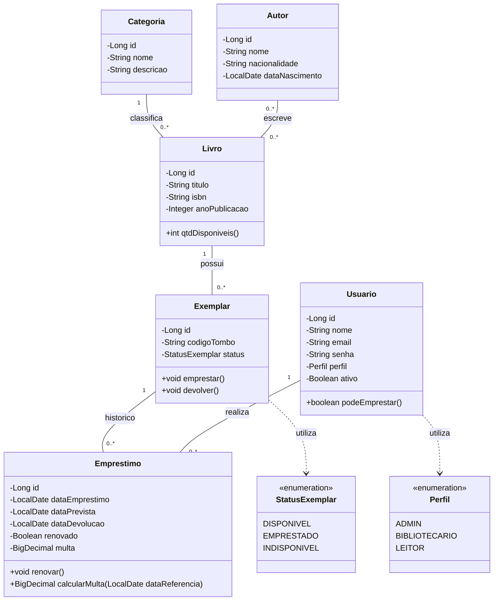

# Diagrama de Classes — BiblioTech

```mermaid
classDiagram
direction TB

class Categoria {
    -Long id
    -String nome
    -String descricao
}

class Autor {
    -Long id
    -String nome
    -String nacionalidade
    -LocalDate dataNascimento
}

class Livro {
    -Long id
    -String titulo
    -String isbn
    -Integer anoPublicacao
    +int qtdDisponiveis()
}

class Exemplar {
    -Long id
    -String codigoTombo
    -StatusExemplar status
    +void emprestar()
    +void devolver()
}

class Usuario {
    -Long id
    -String nome
    -String email
    -String senha
    -Perfil perfil
    -Boolean ativo
    +boolean podeEmprestar()
}

class Emprestimo {
    -Long id
    -LocalDate dataEmprestimo
    -LocalDate dataPrevista
    -LocalDate dataDevolucao
    -Boolean renovado
    -BigDecimal multa
    +void renovar()
    +BigDecimal calcularMulta(LocalDate dataReferencia)
}

class Perfil {
    <<enumeration>>
    ADMIN
    BIBLIOTECARIO
    LEITOR
}

class StatusExemplar {
    <<enumeration>>
    DISPONIVEL
    EMPRESTADO
    INDISPONIVEL
}

Categoria "1" -- "0..*" Livro : classifica
Autor "0..*" -- "0..*" Livro : escreve
Livro "1" -- "0..*" Exemplar : possui
Exemplar "1" -- "0..*" Emprestimo : historico
Usuario "1" -- "0..*" Emprestimo : realiza
Usuario ..> Perfil : utiliza
Exemplar ..> StatusExemplar : utiliza
```